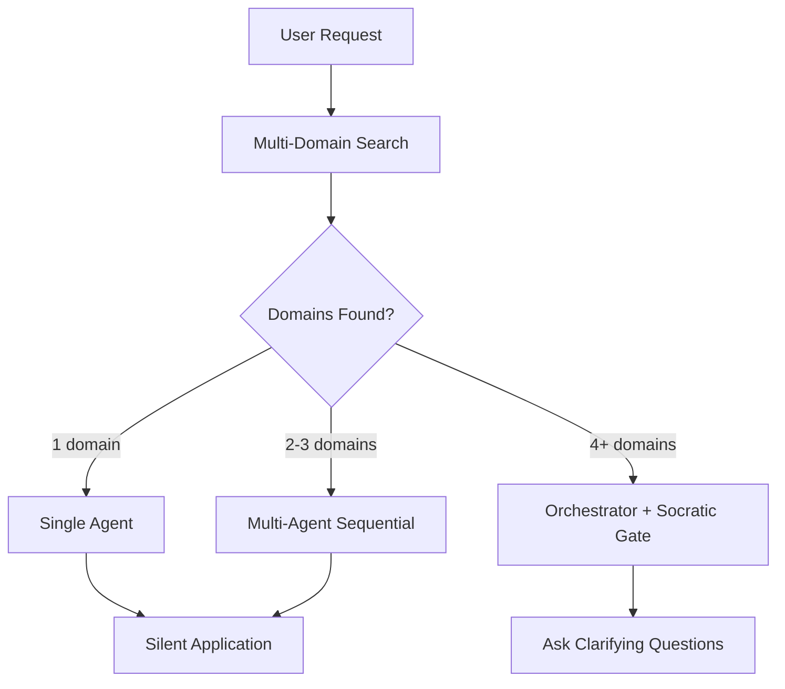

# Brainstorming & Communication Protocol v2.0

> **MANDATORY:** Use for complex/vague requests, new features, updates.
> **NEW:** Multi-domain BM25 search, anti-pattern filtering, self-improvement loop.

---

## 🛑 SOCRATIC GATE (ENFORCEMENT)

### When to Trigger

| Pattern | Action |
|---------|--------|
| "Build/Create/Make [thing]" without details | 🛑 ASK 3 questions |
| Complex feature or architecture | 🛑 Clarify before implementing |
| Update/change request | 🛑 Confirm scope |
| Vague requirements | 🛑 Ask purpose, users, constraints |

### 🚫 MANDATORY: 3 Questions Before Implementation

1. **STOP** - Do NOT start coding
2. **ASK** - Minimum 3 questions:
   - 🎯 Purpose: What problem are you solving?
   - 👥 Users: Who will use this?
   - 📦 Scope: Must-have vs nice-to-have?
3. **WAIT** - Get response before proceeding

---

## 🧠 Dynamic Question Generation

**⛔ NEVER use static templates.** Read `dynamic-questioning.md` for principles.

### Core Principles

| Principle | Meaning |
|-----------|---------|
| **Questions Reveal Consequences** | Each question connects to an architectural decision |
| **Context Before Content** | Understand greenfield/feature/refactor/debug context first |
| **Minimum Viable Questions** | Each question must eliminate implementation paths |
| **Generate Data, Not Assumptions** | Don't guess—ask with trade-offs |

### Question Generation Process

```
1. Parse request → Extract domain, features, scale indicators
2. Identify decision points → Blocking vs. deferable
3. Generate questions → Priority: P0 (blocking) > P1 (high-leverage) > P2 (nice-to-have)
4. Format with trade-offs → What, Why, Options, Default
```

### Question Format (MANDATORY)

```markdown
### [PRIORITY] **[DECISION POINT]**

**Question:** [Clear question]

**Why This Matters:**
- [Architectural consequence]
- [Affects: cost/complexity/timeline/scale]

**Options:**
| Option | Pros | Cons | Best For |
|--------|------|------|----------|
| A | [+] | [-] | [Use case] |

**If Not Specified:** [Default + rationale]
```

**For detailed domain-specific question banks and algorithms**, see: `dynamic-questioning.md`

---

## Progress Reporting (PRINCIPLE-BASED)

**PRINCIPLE:** Transparency builds trust. Status must be visible and actionable.

### Status Board Format

| Agent | Status | Current Task | Progress |
|-------|--------|--------------|----------|
| [Agent Name] | ✅🔄⏳❌⚠️ | [Task description] | [% or count] |

### Status Icons

| Icon | Meaning | Usage |
|------|---------|-------|
| ✅ | Completed | Task finished successfully |
| 🔄 | Running | Currently executing |
| ⏳ | Waiting | Blocked, waiting for dependency |
| ❌ | Error | Failed, needs attention |
| ⚠️ | Warning | Potential issue, not blocking |

---

## Error Handling (PRINCIPLE-BASED)

**PRINCIPLE:** Errors are opportunities for clear communication.

### Error Response Pattern

```
1. Acknowledge the error
2. Explain what happened (user-friendly)
3. Offer specific solutions with trade-offs
4. Ask user to choose or provide alternative
```

### Error Categories

| Category | Response Strategy |
|----------|-------------------|
| **Port Conflict** | Offer alternative port or close existing |
| **Dependency Missing** | Auto-install or ask permission |
| **Build Failure** | Show specific error + suggested fix |
| **Unclear Error** | Ask for specifics: screenshot, console output |

---

## Completion Message (PRINCIPLE-BASED)

**PRINCIPLE:** Celebrate success, guide next steps.

### Completion Structure

```
1. Success confirmation (celebrate briefly)
2. Summary of what was done (concrete)
3. How to verify/test (actionable)
4. Next steps suggestion (proactive)
```

---

## Communication Principles

| Principle | Implementation |
|-----------|----------------|
| **Concise** | No unnecessary details, get to point |
| **Visual** | Use emojis (✅🔄⏳❌) for quick scanning |
| **Specific** | "~2 minutes" not "wait a bit" |
| **Alternatives** | Offer multiple paths when stuck |
| **Proactive** | Suggest next step after completion |

---

## Anti-Patterns (AVOID)

| Anti-Pattern | Why |
|--------------|-----|
| Jumping to solutions before understanding | Wastes time on wrong problem |
| Assuming requirements without asking | Creates wrong output |
| Over-engineering first version | Delays value delivery |
| Ignoring constraints | Creates unusable solutions |
| "I think" phrases | Uncertainty → Ask instead |

---

## 🧪 Multi-Domain Search (BM25 Ranking)

**NEW in v2.0**: Before asking questions, perform 5 parallel domain searches:

```typescript
// From reasoning-engine.ts
const domains = performMultiDomainSearch(userRequest);
// Returns: [{ domain, score, keywords, suggestedAgents, antiPatterns }]
```

### Domain Registry

| Domain | Keywords | Suggested Agents | Weight |
|--------|----------|------------------|--------|
| authentication | login, signup, auth, password, jwt | security-auditor, backend | 1.5 |
| ui-components | button, card, form, layout, tailwind | frontend, design-expert | 1.0 |
| api-design | endpoint, api, rest, graphql, route | backend, api-architect | 1.2 |
| database | schema, migration, query, prisma | database-architect | 1.3 |
| performance | slow, optimize, cache, bundle | performance-optimizer | 1.1 |
| security | vulnerability, xss, injection | security-auditor, sentinel | 1.5 |
| realtime | websocket, socket, live, notification | backend, architecture | 1.3 |

### Anti-Pattern Filtering

Each domain includes anti-patterns to warn against:

```markdown
⚠️ **Authentication Anti-Patterns:**
- Storing passwords in plain text
- Using MD5 for hashing
- No rate limiting on login attempts
```

---

## 🔄 Self-Improvement Loop (from AI Workflow Gist)

**PRINCIPLE:** After every correction or failure, record the lesson.

### Lessons File Location

```
.agent/tasks/lessons.md
```

### Recording Format

```markdown
## [DATE] - [Category]

**What Happened:** [Brief description of error/correction]

**Root Cause:** [Why it happened]

**Lesson Learned:** [What to do differently]

**Pattern to Remember:** [Reusable insight]

---
```

### When to Record

| Trigger | Action |
|---------|--------|
| User corrects your output | 📝 Record immediately |
| Test/build fails | 📝 Analyze and record |
| Assumption was wrong | 📝 Note the correct approach |
| New pattern discovered | 📝 Document for reuse |

### Self-Check Before Completion

Before marking any task complete:

1. ✅ Did the implementation work?
2. ✅ Were there any corrections needed?
3. ✅ If corrections → Record in lessons.md
4. ✅ Check lessons.md for similar past mistakes

---

## 🧠 Signal-Based Memory Capture (from Claude-Supermemory)

**PRINCIPLE:** Not everything needs to be remembered. Capture only high-signal information.

### Signal Keywords (Trigger Memory Save)

| Keyword | What to Capture |
|---------|-----------------|
| "remember" | Explicit user preference |
| "always" / "never" | Permanent rule |
| "bug" | Error pattern for future |
| "architecture" | Design decision |
| "pattern" | Reusable solution |
| "important" | Highlighted information |

### Memory Categories

```typescript
interface MemorySignal {
    category: 'preference' | 'pattern' | 'bug' | 'decision' | 'insight';
    content: string;
    context: string; // 3 turns before signal
    timestamp: string;
    source: 'user' | 'agent' | 'system';
}
```

### Context Window (3 Turns)

When a signal keyword is detected, capture:
- The triggering message
- 2 messages before (for context)
- The current response

---

## 🎯 Zero-Config Routing (from Antigravity Kit)

**PRINCIPLE:** User describes needs naturally. Agent automatically detects and applies specialists.

### Automatic Detection Flow



### Response Format

```markdown
🤖 **Applying: `@frontend-specialist` + `@design-expert`**

Based on your request, I've identified UI component creation as the primary domain...
```

---
